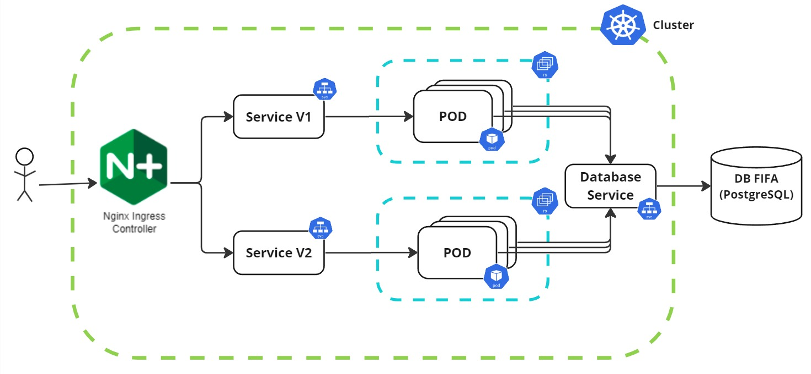
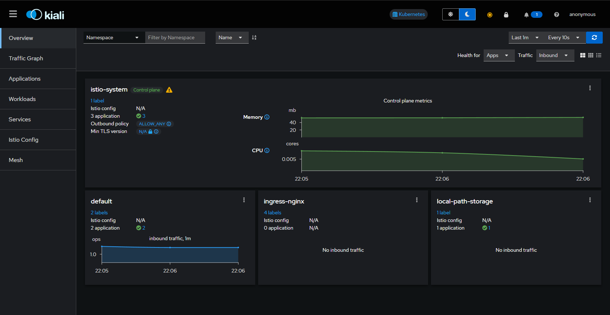
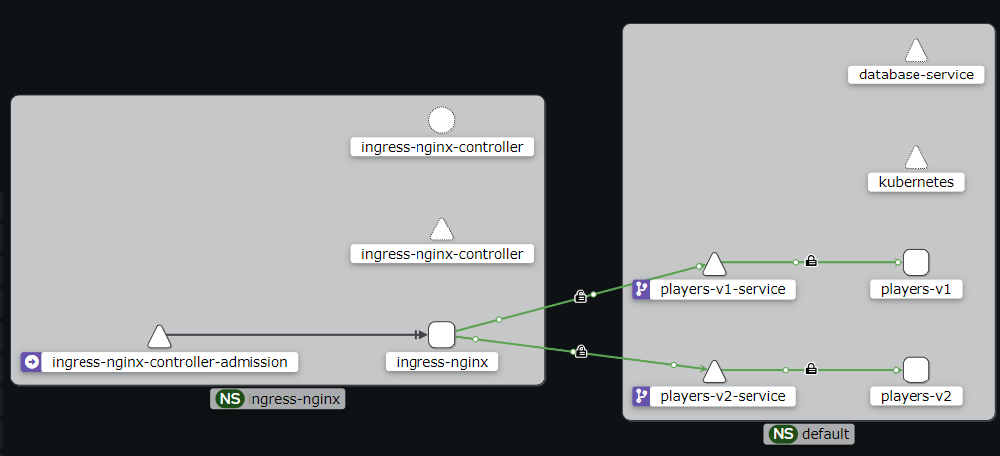
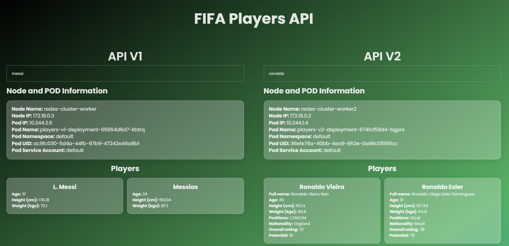

# Trabajo Práctico Especial: Kubernetes

## Autores - Grupo 13
- [Tomas Alvarez Escalante](https://github.com/tomalvarezz)
- [Alejo Caeiro](https://github.com/AleCaeiro)
- [Lucas Agustin Ferreiro](https://github.com/lukyferreiro)
- [Roman Gomez Kiss](https://github.com/rgomezkiss)

## Índice
1. [Consigna](#consigna)
2. [Introducción](#introducción)
3. [Entorno](#entorno)
4. [Requerimientos previos](#requerimientos-previos)
    - [Docker](#docker)
    - [Kubectl](#kubectl)
    - [Kind (Kubernetes IN Docker)](#kind-kubernetes-in-docker)
5. [Guía de Uso del TPE](#guia-de-uso-del-tpe)
    - [1. Levantar base de datos externa](#1-levantar-base-de-datos-externa)
    - [2. Levantar el cluster de Kubernetes](#2-levantar-el-cluster-de-kubernetes)
    - [3. Configuración de monitoreo (Istio, Kiali y Prometheus)](#3-configuracion-de-monitoreo)
    - [4. Buildear las imágenes de las versiones de la API](#4-buildear-las-imagenes)
    - [5. Levantar el servicio a la BD externa](#5-levantar-el-servicio-a-la-bd-externa)
    - [6. Levantar los servicios de la API](#6-levantar-los-servicios-de-la-api)
    - [7. Levantar el Ingress Nginx](#7-levantar-el-ingress-nginx)
    - [8. Testeando el correcto funcionamiento](#8-testeando-el-correcto-funcionamiento)
    - [9. Levantar el frontend](#9-levantar-el-frontend)

## Consigna

- Crear un cluster de Kubernetes de un Master y al menos dos slave, que exponga
una API en un puerto genérico (distinto a 80)
- Implementar una base de datos local en un servidor (por fuera del cluster) y
exponer un servicio que redireccione el tráfico del cluster al servidor.
- Deployar un web server (nginx o Apache HTTPD escuchando en el 80) y hacer
un proxy reverso a la API.
- Mostrar dos versiones de API distintas conviviendo.
- Integrar los servicios de Istio y Kiali al cluster

## Entorno

Todos los siguientes comandos de instalación y ejecución fueron testados en un subsistema de Windows para Linux x86_64 (WSL2), con una distribucion Debian GNU/Linux 10.

`Aclaración: se deberá tener abierto Docker Desktop en todo momento.`

## Introducción

Kubernetes es una plataforma de orquestación de contenedores de código abierto que automatiza la implementación, el escalado y la operación de aplicaciones en contenedores.

## Requerimientos previos

### Docker

Docker es una plataforma de software que permite crear, ejecutar y gestionar contenedores, que son entornos ligeros y portátiles para ejecutar aplicaciones. Los contenedores encapsulan todo lo necesario para que una aplicación se ejecute, incluyendo el código, las bibliotecas y las dependencias, garantizando que funcionen de manera consistente en cualquier entorno. Docker facilita el desarrollo, la implementación y la escalabilidad de aplicaciones, mejorando la eficiencia y la flexibilidad del desarrollo de software.

A continuación se presentan los comandos para instalar [Docker en Ubuntu](https://docs.docker.com/engine/install/ubuntu/) (para la [instalación en otros SO's](https://docs.docker.com/engine/install/))

Antes de instalar Docker desde cero, nos aseguraremos de que el entorno no cuente con versiones/paquetes que entren en conflicto.

```bash
sudo apt-get remove docker docker-engine docker.io containerd runc
```

Para comenzar la instalación, primero se agrega la clave GPG oficial de Docker y el repositorio a las fuentes de Apt:

```bash
sudo apt-get update
```

```bash
sudo apt-get install ca-certificates curl gnupg
```

```bash
sudo install -m 0755 -d /etc/apt/keyrings
```

```bash
curl -fsSL https://download.docker.com/linux/ubuntu/gpg | sudo gpg --dearmor -o /etc/apt/keyrings/docker.gpg
```

```bash
sudo chmod a+r /etc/apt/keyrings/docker.gpg
```

```bash
echo \
  "deb [arch="$(dpkg --print-architecture)" signed-by=/etc/apt/keyrings/docker.gpg] https://download.docker.com/linux/ubuntu \
  "$(. /etc/os-release && echo "$VERSION_CODENAME")" stable" | \
  sudo tee /etc/apt/sources.list.d/docker.list > /dev/null
```

Luego se instalan los paquetes de Docker y se verifica la correcta instalación:

```bash
sudo apt-get install docker-ce docker-ce-cli containerd.io docker-buildx-plugin docker-compose-plugin
```

```bash
sudo docker run --rm hello-world
```

#### Crear usuario y grupo de Docker

Los comandos de esta sección tienen como objetivo evitar ejecutar los contenedores como root:

```bash
sudo groupadd docker
```

```bash
sudo usermod -aG docker ${USER}
```

Para aplicar los cambios, se debe reiniciar la sesión del usuario. Adicionalmente, podemos verificar ejecutando nuevamente la siguiente imagen (y luego la eliminamos):

```bash
docker run --rm hello-world
```

```bash
docker rmi hello-world
```

### Kubectl

Kubectl es una herramienta de línea de comandos utilizada para interactuar y gestionar clusters de Kubernetes. Permite a los usuarios desplegar aplicaciones, inspeccionar y administrar recursos del cluster, y realizar tareas de mantenimiento y depuración.

A continuación se presentan los comandos para descargar e instalar [Kubectl en Ubuntu](https://kubernetes.io/docs/tasks/tools/install-kubectl-linux/) (para la [instalación en otros SO's](https://kubernetes.io/docs/tasks/tools/#kubectl))

- Para AMD64 / x86_64:

```bash
curl -LO "https://dl.k8s.io/release/$(curl -L -s https://dl.k8s.io/release/stable.txt)/bin/linux/amd64/kubectl"
```

- Para ARM64:

```bash
curl -LO "https://dl.k8s.io/release/$(curl -L -s https://dl.k8s.io/release/stable.txt)/bin/linux/arm64/kubectl" 
```

Una vez descargado, se debe instalar Kubectl y verificar la correcta instalación:

```bash
sudo install -o root -g root -m 0755 kubectl /usr/local/bin/kubectl
```

```bash
kubectl version --client
```

### Kind (Kubernetes IN Docker)

Kind es una herramienta diseñada para ejecutar clusters de Kubernetes locales utilizando contenedores Docker como nodos. Es ideal para pruebas, desarrollo y aprendizaje de Kubernetes sin necesidad de configurar una infraestructura compleja. Kind permite crear y administrar clusters de Kubernetes en cuestión de minutos, facilitando la experimentación y el desarrollo de aplicaciones en un entorno controlado y reproducible. Tambien permite especificar la cantidad de nodos worker y de nodos del control plane del clúster sin necesidad de infraestructura compleja ni recursos adicionales.

A continuación se presentan los comandos para descargar e instalar [Kind en Linux (u otros SO's)](https://kind.sigs.k8s.io/docs/user/quick-start/#installation)

Primero, deberá descargarse el ejecutable compatible:

- Para AMD64 / x86_64:

```bash
[ $(uname -m) = x86_64 ] && curl -Lo ./kind https://kind.sigs.k8s.io/dl/v0.19.0/kind-linux-amd64
```

- Para ARM64:

```bash
[ $(uname -m) = aarch64 ] && curl -Lo ./kind https://kind.sigs.k8s.io/dl/v0.19.0/kind-linux-arm64
```

Una vez descargado, se deberá ejecutar:

```bash
chmod +x ./kind
```

```bash
sudo mv ./kind /usr/local/bin/kind
```

<a id="guia-de-uso-del-tpe"></a>
## Guía de Uso del TPE

Como primer paso, se deberá clonar el [repositorio](https://github.com/lukyferreiro/TPE-Redes-Kubernetes) y posicionarse en la carpeta correspondiente:

```bash
git clone https://github.com/lukyferreiro/TPE-Redes-Kubernetes
```

```bash
cd ./TPE-Redes-Kubernetes
```

A continuación, se presentaran todos los pasos para levantar un clúster de Kubernetes que cumpla con lo solicitado en la consigna. El objetivo es lograr la siguiente arquitectura:



### 1. Levantar base de datos externa

Primero se debe crear un archivo .env dentro de la carpeta  `database` (el que se encuentra a la misma altura que `docs` y `kubernetes`) con las siguientes variables:

```bash
POSTGRES_DB=players
POSTGRES_USER=user
POSTGRES_PASSWORD=password
```

Luego se creará el container de Docker que contará con una imagen de una base de datos PostgreSQL, con un volumen persistente para almacenamiento y cargado con registros de [información de jugadores de la FIFA](https://www.kaggle.com/datasets/maso0dahmed/football-players-data). Cabe destacar que este container se encontrara fuera del cluster de Kubernetes (el clúster se comunicará con la BD mediante un servicio de Kubernetes encargado de exponerla, esto se explicará en secciones posteriores).

```bash
docker compose  -f ./database/docker-compose.yml up -d
```

Con este comando el container se encontrara corriendo en 2do plano. Se puede observar esto corriendo el comando:

```bash
docker ps
```

```bash
#Se deberia obtener una salida similar a esta:
CONTAINER ID   IMAGE               COMMAND                  CREATED         STATUS                            PORTS     NAMES
413675dddc2f   database-database   "docker-entrypoint.s…"   5 seconds ago   Up 3 seconds (health: starting)             database
```

### 2. Levantar el cluster de Kubernetes

Seguidamente, se creará el clúster de Kubernetes denominado `redes-cluster`, el cual se configurará con un nodo master y dos slaves:

```bash
kind create cluster --config kubernetes/cluster-config.yaml
```

Una vez inicializado el clúster, se podrán visualizar los tres nodos en ejecución:

```bash
kubectl get nodes -o wide
```

```bash
#Se deberia obtener una salida similar a esta:
NAME                          STATUS   ROLES           AGE     VERSION   INTERNAL-IP 
redes-cluster-control-plane   Ready    control-plane   2m59s   v1.27.1   172.18.0.4 
redes-cluster-worker          Ready    <none>          2m39s   v1.27.1   172.18.0.3
redes-cluster-worker2         Ready    <none>          2m38s   v1.27.1   172.18.0.2 
```

<a id="3-configuracion-de-monitoreo"></a>
### 3. Configuración de monitoreo (Istio, Kiali y Prometheus)

Para el monitoreo del clúster se utilizarán las herramientas Istio y Kiali, junto a otras utilidades como Prometheus. 

- [**Istio**](https://istio.io/latest/docs/setup/getting-started/): Es un service mesh que permite gestionar el tráfico entre las componentes dentro del clúster de Kubernetes, todo sin requerir cambios en el código de los servicios.

- [**Kiali**](https://github.com/istio/istio/tree/release-1.22/samples/addons): Es una herramienta de observabilidad y gestión que se utiliza junto con Istio para proporcionar una interfaz gráfica que permite visualizar, monitorear y gestionar los servicios Istio.

- [**Prometheus**](https://github.com/istio/istio/tree/release-1.22/samples/addons): Es una herramienta que recopila métricas de Istio y otros componentes de Kubernetes para monitorear el estado del clúster y de las aplicaciones.

En primer lugar instalaremos la ultima versión de Istio:

```bash
curl -L https://istio.io/downloadIstio | sh -
```

```bash
# Si descargo otra versión, moverse a la carpeta correspondiente
cd istio-1.22.0
```

```bash
export PATH="$PATH:$PWD/bin"
```

```bash
cd ..
```

Verificamos que Istio se encuentre dentro del cluster:

```bash
istioctl x precheck
```

```bash
#Se deberia obtener esta salida:
✔ No issues found when checking the cluster. Istio is safe to install or upgrade!
  To get started, check out https://istio.io/latest/docs/setup/getting-started/
```

Luego se configurará el servicio de Istio, se agregaran Kiali y Prometheus en el Cluster y se aplicara la injection de Istio en los namespaces a utilizar con los siguientes comandos:

```bash
istioctl install --set profile=default -y
```

```bash
kubectl apply -f ./kubernetes/kiali/kiali.yaml
```

```bash
kubectl apply -f ./kubernetes/prometheus/prometheus.yaml
```

```bash
kubectl label namespace default istio-injection=enabled
```

```bash
kubectl create namespace ingress-nginx
```

```bash
kubectl label namespace ingress-nginx istio-injection=enabled
```

<a id="4-buildear-las-imagenes"></a>
### 4. Buildear las imágenes de las versiones de la API 

En esta sección se describen los pasos para generar las imágenes de las 2 versiones de la API que consultan a la base de datos externa:

```bash
docker build -t players:v1 ./kubernetes/backend/players/v1/image
```

```bash
docker build -t players:v2 ./kubernetes/backend/players/v2/image
```

Podemos verificar que las imágenes se crearon correctamente corriendo:

```bash
docker images
```

```bash
#Se deberia obtener una salida similar a esta:
REPOSITORY          TAG       IMAGE ID       CREATED          SIZE
players              v2        1e2c334729af   13 seconds ago   181MB
players              v1        a1f94c04d9c2   24 seconds ago   181MB
```

Luego se deberán cargar las imágenes dentro clúster para poder instanciarlas:

```bash
kind load docker-image players:v1 --name redes-cluster
```

```bash
kind load docker-image players:v2 --name redes-cluster
```

### 5. Levantar el servicio a la BD externa

Ahora se levantará un recurso de Endpoints y un recurso de Service:
- **Endpoints**: define la dirección IP 172.17.0.1 para el servicio database-service; esta IP debe ser accesible desde el clúster de Kubernetes y apunta a la BD externa.
- **Service**: al definirse con clusterIP: None es un "Headless Service", lo cual implica que no se asignará una IP de clúster para el servicio y en su lugar, Kubernetes utilizará los Endpoints directamente para la resolución DNS.

Es decir, de esta forma, Kubernetes resuelva el nombre database-service directamente y redirige el tráfico a la direccion IP 172.17.0.1 especificada en el Endpoints, sin asignar una IP de clúster al servicio.

```bash
kubectl apply -f ./kubernetes/database/
```

Se puede verificar la creación del servicio ejecutando:


```bash
kubectl get services -o wide
```

```bash
#Se deberia obtener una salida similar a esta:
NAME                 TYPE        CLUSTER-IP      EXTERNAL-IP   PORT(S)    AGE     SELECTOR
database-service     ClusterIP   None            <none>        <none>     2m25s   <none>
```

### 6. Levantar los servicios de la API

En primer lugar, se aplicará el *secret.yaml* para establecer las variables de conexión a la BD externa:

```bash
kubectl apply -f ./kubernetes/backend/players/secret.yaml
```

Para continuar se deberá hacer el deploy de los servicios de ambas versiones de la API, que permitirán la comunicación con los PODs del mismo.

```bash
kubectl apply -f ./kubernetes/backend/players/v1
```

```bash
kubectl apply -f ./kubernetes/backend/players/v2
```

Con estos comandos se aplica lo siguiente:

- El archivo *deployment.yaml* se encargará de levantar un Deployment con un Replica Set de tres réplicas, asegurando redundancia y escalabilidad.

  - Para cada POD se define el label app:players-vX (donde X será 1 o 2 según la versión que corresponda)
  - En el Replica Set se define un selector para monitorear el estado de los PODs. El Replica Set se utiliza para garantizar que se encuentren tres PODs ejecutándose en todo momento (si alguno se cae se elimina y se crea uno nuevo).
  - Cada una de estas réplicas se ejecuta en un POD distinto, otorgándoles un ID diferente (incluso puede haber PODs que se encuentren en distintos nodos). 

- El archivo *service.yaml* se encargará de levantar un Service de tipo ClusterIP que permitirá el acceso centralizado a los PODs para las distintas componentes dentro del clúster.
  - El tipo ClusterIP posee una IP fija, solucionando el problema del cambio constante de IPs (pues recordemos que los PODs son efímeros, estos pueden fallar y reiniciarse en cualquier momento, provocando cambios en la IP asignada).
  - Se utiliza un selector que monitorea el label definido en cada una de las réplicas para acceder a los PODs de manera centralizada, sin tener que contar con conocimiento sobre la IP de los mismos.
  - Los servicios exponen un nombre que será resuelto por el servicio DNS interno que posee Kubernetes para facilitar el acceso al mismo. Cada vez que se realice un pedido al servicio, este se encargará de delegarlo a uno de los PODs utilizando un algoritmo de balanceo round robin.

En conclusión, por cada versión de la API se tendrá:
- Un Deployment que especifica la imagen del contenedor que se utilizará y la cantidad de réplicas.
- Un Replica Set con tres réplicas de la API ejecutándose
- Un Servicio para exponer el acceso centralizado a los PODs.

Se puede verificar la creación de los PODs y de los servicios ejecutando:

```bash
kubectl get pods -o wide
```

```bash
#Se deberia obtener una salida similar a esta:
NAME                                     READY   STATUS    RESTARTS   AGE   IP           NODE
players-v1-deployment-65664d6d7-78cj5    2/2     Running   0          38s   10.244.1.5   redes-cluster-worker2
players-v1-deployment-65664d6d7-kssrk    2/2     Running   0          38s   10.244.1.6   redes-cluster-worker2
players-v1-deployment-65664d6d7-xdv8j    2/2     Running   0          38s   10.244.2.3   redes-cluster-worker
players-v2-deployment-674fcf58d4-4twkj   2/2     Running   0          33s   10.244.1.7   redes-cluster-worker2
players-v2-deployment-674fcf58d4-bc277   2/2     Running   0          33s   10.244.2.4   redes-cluster-worker
players-v2-deployment-674fcf58d4-nfvr9   2/2     Running   0          33s   10.244.1.8   redes-cluster-worker2
```

```bash
kubectl get services -o wide
```

```bash
#Se deberia obtener una salida similar a esta:
NAME                 TYPE        CLUSTER-IP      EXTERNAL-IP   PORT(S)    AGE     SELECTOR
players-v1-service   ClusterIP   10.96.102.200   <none>        9090/TCP   72s     app=players-v1
players-v2-service   ClusterIP   10.96.41.4      <none>        9090/TCP   67s     app=players-v2
```

### 7. Levantar el Ingress Nginx

Por último, levantaremos el [Ingress](https://kubernetes.io/docs/concepts/services-networking/ingress/), el cual actuará como punto de acceso externo al clúster de Kubernetes, permitiendo el acceso desde afuera del cluster.

Para poder configurar un Ingress, se configurará el [Ingress Controller de Nginx](https://github.com/kubernetes/ingress-nginx), que otorga ciertas funcionalidades como enrutamiento basado en hosts y rutas, load balancing, soporte para TLS/SSL, y redirecciones y reescrituras.

En general, este Ingress Controller de Nginx necesita:
 - Puerto 8443 abierto entre todos los hosts en los que se ejecutan los nodos de Kubernetes (usado para el controlador de admisión ingress-nginx).
 - Puerto 80 (para HTTP) y/o 443 (para HTTPS) abiertos al público en los nodos de Kubernetes a los que apunta el DNS de tus aplicaciones.

 A continuacion se presentan los comandos basados en la [guía de instalación](https://kubernetes.github.io/ingress-nginx/deploy/) (tener en consideración lo encontrado en el siguiente post: [Using Istio with Nginx ingress](https://www.giffgaff.io/tech/using-istio-with-nginx-ingress)):


```bash
kubectl apply -f ./kubernetes/ingress-nginx/controller-nginx-ingress.1.10.1.yaml
```

```bash
kubectl wait --namespace ingress-nginx --for=condition=ready pod --selector=app.kubernetes.io/component=controller --timeout=120s && kubectl apply -f ./kubernetes/ingress-nginx/ingress.yaml
```

Podemos verificar los componentes que se crearon ejecutando

```bash
kubectl get pods -o wide --namespace=ingress-nginx
```

```bash
#Se deberia obtener una salida similar a esta:
NAME                                        READY   STATUS     RESTARTS   AGE   IP            NODE
ingress-nginx-admission-create-zjw9t        1/2     NotReady   1          74s   10.244.2.9    redes-cluster-worker
ingress-nginx-admission-patch-g29g4         1/2     NotReady   1          74s   10.244.2.10   redes-cluster-worker
ingress-nginx-controller-6948cd7b94-pjg9w   2/2     Running    0          74s   10.244.2.11   redes-cluster-worker
```

```bash
kubectl get service --namespace=ingress-nginx
```

```bash
#Se deberia obtener una salida similar a esta:
NAME                                 TYPE           CLUSTER-IP      EXTERNAL-IP   PORT(S)                      AGE
ingress-nginx-controller             LoadBalancer   10.96.164.216   <pending>     80:30412/TCP,443:32396/TCP   59s
ingress-nginx-controller-admission   ClusterIP      10.96.152.93    <none>        443/TCP                      58s
```

```bash
kubectl get ingress  -o wide
```

```bash
#Se deberia obtener una salida similar a esta:
NAME                    CLASS   HOSTS             ADDRESS   PORTS   AGE
nginx-reverse-proxy-1   nginx   api.players.com             80      4m50s
nginx-reverse-proxy-2   nginx   api.players.com             80      4m50s
```

Por último se realizará un port forwarding del servicio del ingress-controller a un puerto generico (en este caso utilizaremos el puerto 5000):

```bash
kubectl port-forward --namespace=ingress-nginx svc/ingress-nginx-controller --address 0.0.0.0 5000:80&
```

Ahora, el tráfico enviado al puerto 5000 en localhost se reenvía al puerto 80 del servicio del ingress-controller en el clúster. Es decir, se fowardeará el servicio para que pueda ser accedido desde fuera del clúster por la máquina host. Este port-forwarding es necesario, ya que al estar trabajando en localhost, no se contará con una IP pública (en un caso real de producción el Ingress tendría asignada una IP pública para accederlo).

El Ingress definirá reglas de redirección para el nombre `api.players.com`. Para poder ser accedido localmente mediante DNS, será necesario agregar dicha resolución en el archivo `/etc/hosts`.

```bash
sudo nano /etc/hosts
```

```bash
# Agregar esta linea en el archivo
127.0.0.1 api.players.com
```

### 8. Testeando el correcto funcionamiento

Para finalizar y verificar el correcto funcionamiento, se podrán realizar llamados a la API en sus respectivos endpoints:

```bash
curl -i "api.players.com:5000/v1/"
curl -i "api.players.com:5000/v1/players?name=messi&size=5"
curl -i "api.players.com:5000/v1/players/1"
```

```bash
curl -i "api.players.com:5000/v2/"
curl -i "api.players.com:5000/v2/players?name=ronaldo&size=5"
curl -i "api.players.com:5000/v2/players/1"
```

En la respuesta de la API, podrá observarse en qué nodo worker se encuentra el POD que emite la respuesta, el ID del mismo, su IP dentro de la red del clúster de Kubernetes y más información.

Para poder visualizar la configuración de Istio, se realizará un port forwarding de la interfaz visual de Kiali:


```bash
istioctl dashboard kiali --address 0.0.0.0 &
```

Con este comando se levantara Kiali localmente en http://localhost:20001/



Para generar tráfico en el clúster, se ejecutará el siguiente comando:

```bash
while sleep 1; do curl "api.players.com:5000/v1/players/1" && curl "api.players.com:5000/v2/players/1"; done
```



### 9. Levantar el frontend

Adicionalmente, se implementó un frontend para poder interactuar con la API del cluster. En primer lugar, se debera instalar node y npm: 

```bash
sudo apt update
sudo apt upgrade
```

```bash
curl -o- https://raw.githubusercontent.com/nvm-sh/nvm/v0.39.3/install.sh | bash
```

```bash
source ~/.bashrc
```

```bash
nvm install node
```

Verificamos la correcta instalación con:

```bash
node -v
npm -v
```

Finalmente, para poder levantar el frontend, se deberá ejecutar:

```bash
cd frontend
npm install
npm run dev
```

`Aclaración:` Como estamos trabajando en entorno de WSL2 en Windows, tambien tenemos que ser capaces de resolver el nombre api.players.com. Por lo tanto, abrimos Windows Powershell como administrador y ejecutamos:

```bash
C:\Windows\System32\drivers\etc\hosts
```

```bash
# Añadir esta linea en el archivo /etc/hosts de Windows
127.0.0.1 api.players.com
```


